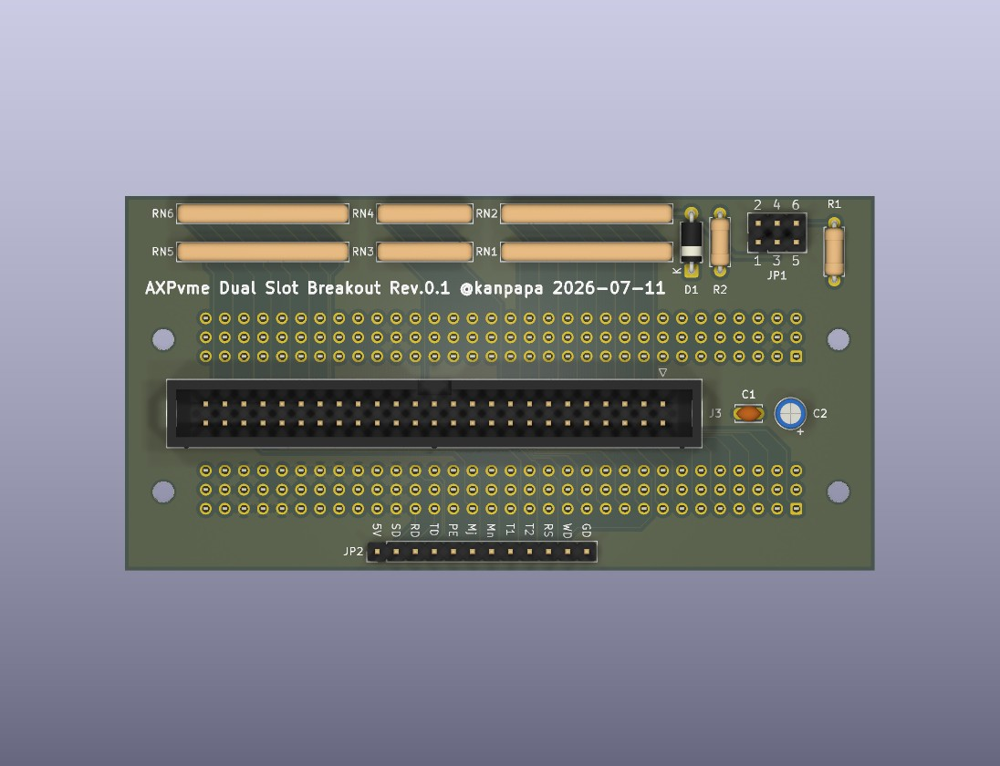
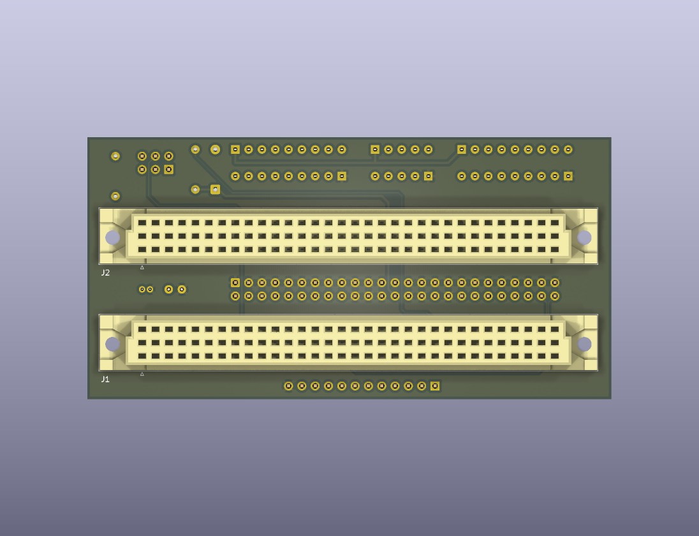

# VME_axpvme230_p2_dual

DEC AXPvme 230 moduleをVMEラックに実装するためのAXPvme Dual Slot Breakout moduleです。

## Breakout boardの設計方針

* VMEラックにおいてAXPvme 230 moduleに確実に電源を供給することを目標にします。
* SCSIやその他の信号についてはコネクタに引き出すだけにします。
* 電源ラインは4層基板にすることで他の信号から電源ラインを分離します。

## KiCadデータ

KiCADで設計からガーバーデータの作成を行いました。

* [回路図](./VME_axpvme230_p2_dual_sch.pdf)
* [BOM](./VME_axpvme230_p2_dual.csv)
* [Garber](./gerber/)

## Dual Slot Breakout boardのイメージ図

## Disclaimer
The contents of this repository are the result of personal research and are provided "as is" without any warranty.